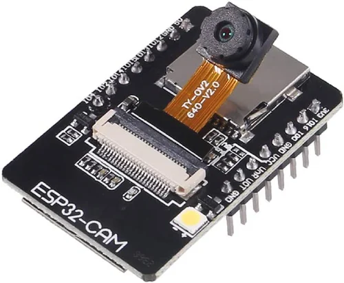
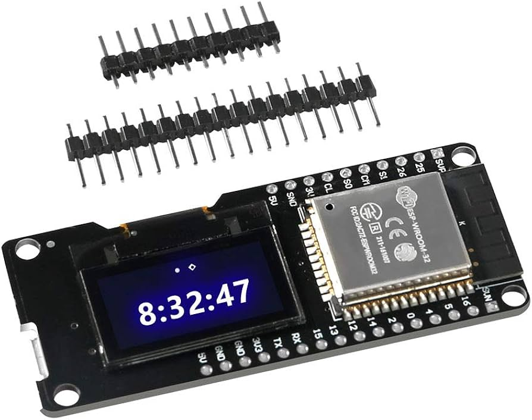
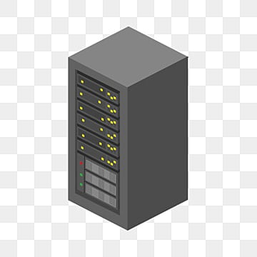

# 📹 Face Count System and Buzzer Alert System 📢

This project involves a distributed system using ESP32 modules to stream video, detect and count human faces, and trigger a buzzer based on the max detected face count limit. The system consists of three main components:

1. **ESP32-CAM Module**: Streams live video.
2. **Face Detection Server**: Processes the video stream to count faces.
3. **Pocket ESP32 Module**: Receives face count updates shows it in led and triggers a buzzer in real-time.

## 🎯 How It Works

1. **Video Streaming**: The ESP32-CAM captures and streams live video to the Face Detection Server.
2. **Face Detection**: The Face Detection Server receives the video stream, processes it using face detection algorithms, and counts the number of faces.
3. **Real-Time Updates**: The Pocket ESP32 Module receives face count data and triggers the buzzer based on predefined conditions.

## 🛠️ Technologies Used

- **ESP32-CAM Module**: For video capture and streaming.
- **OpenCV**: For face detection and image processing.
- **Python/Node.js**: For Face Detection Server implementation.
- **MQTT/HTTP**: For communication between Face Detection Server and Pocket ESP32 Module.
- **Raspberry Pi/Computer**: To run the Face Detection Server.

## 📷 System Architecture

The following diagram illustrates the architecture of the system:

```plaintext
                   +-----------------------------+
                   |     ESP32-CAM Module        |
                   |   Streams live video        |
                   +-----------------------------+
                               |
                               V
                   +-----------------------------+
                   |   Face Detection Server     |
                   | Receives and processes the  |
                   | video stream, counts faces  |
                   +-----------------------------+
                               |
                               V
                   +-----------------------------+
                   |  Pocket ESP32 Module        |
                   | Updates face count and      |
                   | triggers buzzer in real-time|
                   +-----------------------------+
```

## Project Components

1. **ESP32-CAM (Video Stream)**
   - **Function:** Streams live video feed.
   - **Endpoints:**
     - `/`: Provides video stream.
   - **Controls:**
     - **Start Stream:** Starts video streaming.
   - **Image Placeholder:**
     - 

2. **ESP32 pocket Server (Buzzer + LED Control)**
   - **Function:** Controls buzzer and LED based on face count.
   - **Endpoints:**
     - `/on`: Turns on buzzer and LED.
     - `/off`: Turns off buzzer and LED.
     - `/update_count`: Receives total face count updates.
   - **Controls:**
     - **Turn On/Off:** Toggles buzzer and LED.
   - **Image Placeholder:**
     - 

3. **Flask Face Count Server**
   - **Function:** Processes video stream, performs face detection, and tracks faces.
   - **Endpoints:**
     - `/video_feed`: Provides video feed with face detection.
     - `/counts`: Returns the count of detected faces and total faces entered.
   - **Web Interface:**
     - Provides real-time video feed and face count updates.
   - **Image Placeholder:**
     - 

## Setup Instructions

1. **ESP32-CAM Configuration:**
   - Update the Wi-Fi credentials and upload the code to the ESP32-CAM via Arduino IDE.
   - Ensure the camera stream is accessible via HTTP.

2. **ESP32 Server Configuration:**
   - Update the Wi-Fi credentials and upload the code to the ESP32 server via Arduino IDE.
   - This server will control the buzzer and LED.

3. **Flask Server Setup:**
   - Install necessary Python packages: `Flask`, `OpenCV`, `MediaPipe`, `Requests`. or
   - ```bash
     pip install -r requirements.txt
   - Run the Flask server using the provided script.
   - ```bash
     python server.py
   - Access the web interface via `http://<flask_server_ip>:5001`.

## Controls

- **ESP32-CAM:**
  - power on the cam module and connect to the ip address to see the live feed. To check ip address look into serial monitor.

- **ESP32 Server:**
  - can send directly send http request as /on or /off based on the provided ip addresse, again check serial monitor for the ip address.

- **Flask Server:**
  - View the video feed and face count updates via the web interface or the given ip-address.

## Troubleshooting

- Ensure all devices are connected to the same Wi-Fi network, internet connection is not necessary but a router is needed to give private IP addresses for each server. 
- Verify that the IP addresses in the code match the actual device IPs.
- Check serial monitors for any errors during initialization.

## License

This project is licensed under the MIT License - see the [LICENSE](LICENSE) file for details.

## Acknowledgments

- Thanks to the creators of the ESP32 libraries and MediaPipe for making this project possible.
